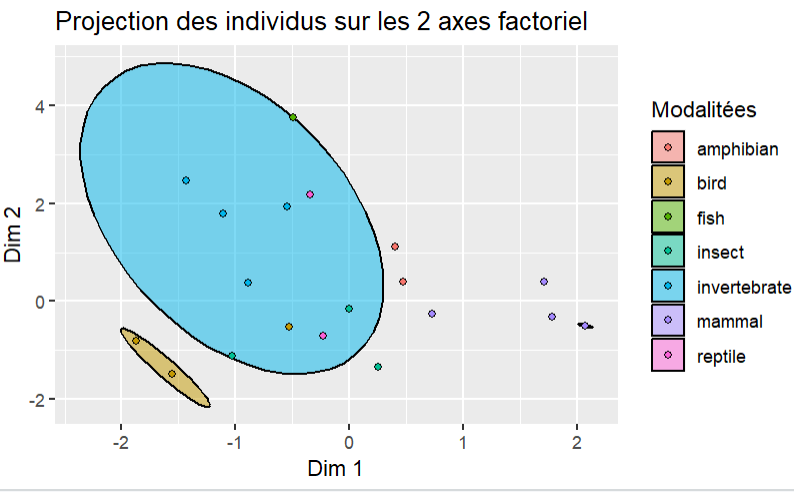

# <center>**Installation of the package**</center>

----

## Installaton with devtools

### Install devtools package for R
```r
install.packages('devtools')
```
### Download the PLSLDA package from github
```r
devtools::install_github('paulineattal/PLSDA_R_Package', subdir='/plslda')
```
or
```r
install_github('paulineattal/PLSDA_R_Package', subdir='/plslda')
```

## Installation from the tar.gz

### Download the tar.gz on your computer

First you need to download the file tar.gz on the repos then you can install it.
To install the package on Rstudio from a local file :
```r
install.packages('your/path/to/the/tar', repos=NULL, type="source)
```
### Or download the tar.gz directly on Rstudio

```r
install.packages('https://github.com/paulineattal/PLSDA_R_Package/blob/main/plslda5_0.1.0.tar.gz', repos=NULL, method='libcurl')
```

-----

# Description of dataset

We will test this package with the zoo dataset, available here https://www.kaggle.com/datasets/uciml/zoo-animal-classification

This dataset consists of 101 animals from a zoo.
There are 16 variables with various traits to describe the animals.
The 7 Class Types are: Mammal, Bird, Reptile, Fish, Amphibian, Bug and Invertebrate

The purpose for this dataset is to be able to predict the classification of the animals, based upon the variables.
It is the perfect dataset for those who are new to learning Machine Learning.

```r
data = read.table("zoo.csv", sep=";", header=TRUE)
print(head(data))

```

    ##   hair airborne aquatic predator toothed breathes venomous fins legs tail domestic catsize   classe
    ##   0        1       1        0       0        1        0    0    2    1        0       0     bird
    ##   1        0       0        0       1        1        0    0    4    1        0       0     mammal
    ##   0        1       0        0       0        1        0    0    2    1        0       0     bird
    ##   0        1       0        0       0        1        0    0    2    1        0       1     bird
    ##   0        0       0        0       0        1        0    0    0    0        0       0     invertebrate
  

# <center>**How to use the package**</center>

________

## Load the package

First you need to load the package
```r
library(plslda5)
```
## Use the help function

You can access the function help to see all the documentation about your function.
```r
help('the_name_of_your_function')
```
or
```r
?the_name_of_your_function
```
## sel.forward()
This function will select only usefull variable en amont de l'application de la methode plsda 
```r
print("Noms des variables avant séléction : ")
print(colnames(data))
sel.data = sel.forward(formula=formula, data=data)
print("Noms des variables avant séléction : ")
print(colnames(sel.data))
```

    ##  Noms des variables avant séléction : 
    ##  "hair"     "airborne" "aquatic"  "predator" "toothed"  "breathes" "venomous" "fins"    "legs"     "tail"     "domestic" "catsize"  "classe"  
    ##  Noms des variables après sélection :
    ##  "classe"   "toothed"  "hair"     "fins"     "tail"     "breathes" "airborne" "aquatic"  "legs"

## plslda.split_sample()
 
This function is used to split your dataset into train and test sets for the method.
```r
print("Total number of rows in dataset: ")
print(nrow(sel.data))
data_split = plslda.split_sample(formula=formula, data=sel.data)
print("Number of rows in the training set: ")
print(nrow(data_split$train))
print("Number of rows in test set: ")
print(nrow(data_split$Xtest))
```
    ##  Total number of rows in dataset :
    ##  53
    ##  Number of rows in the training set: 
    ##  37
    ##  Number of rows in test set : 
    ##  16
    
## plslda.fit()

This function is used to train the plslda model 

```r
object = plslda.fit(formula=formula, data=data_split$train)
print("object class : ")
print(class(object))
```
    ##  object class : 
    ##  PLSDA
```r
print("summary of the object:")
summary(object)
print("printing the object: ")
print(object)
```

    ##  Classification function of X obtained with the PLS-LDA combination: 
    ##    Attributes  amphibian        bird       fish      insect invertebrate     mammal   reptile
    ##  1    toothed  4.2464480 -12.8655335   1.882203 -3.12384736    -4.760769  13.148977   -0.9958712
    ##  2       hair  3.4166492 -12.7748327  -6.168538 -1.79976513    -9.440707  16.753616   -0.9958712
    ##  3       fins  3.5050117  -5.3393906  18.292514 -4.13326177     8.293590  -2.598427    3.6261381
    ##  4       tail -1.6240716   2.4981023  -8.399690  1.90809078    -3.787196   1.142705   -1.6599277
    ##  5   breathes -2.8797757   3.8708073 -16.665741  3.54794944    -8.009017   3.449863   -3.4141201
    ##  6   airborne -5.5944940  15.2333756  -7.921202  4.62096850     2.298601 -12.950323   -0.1339824
    ##  7    aquatic  0.7105437   0.4584143   8.593298 -1.29166047     5.248421  -4.452389    2.0332154
    ##  8       legs  0.2327861  -1.1862779  -1.421776 -0.02959642    -1.374535   1.946283   -0.4598275
    ##  9   constant  1.0705246   3.9846718  23.390151 -2.91610132    15.533293 -15.100386    5.8384388
    ##       reptile

    ## Latent vectors of X: 
    ##            PC1        PC2
    ## 1  -0.88630154  0.3717635
    ## 2   2.07857378 -0.5062780
    ## 3   0.25449856 -1.3454947
    ## 4  -1.10917801  1.7935549
    ## 5   2.07857378 -0.5062780
    ## 6  -0.49214687  3.7567243
    ## ...


## plsda.predict()

```r
ypred = plslda.predict(object=object, newdata=data_split$Xtest)
print(data.frame(ypred=as.factor(ypred), y=data_split$ytest))
```


    ##  ypred            y
    ##  2  mammal       mammal
    ##  5    bird invertebrate
    ##  6    fish         fish
    ##  9    fish    amphibian
    ##  18   fish         fish
    ##  20 mammal       mammal
    ##  25   fish       mammal
    ##  27   bird         bird
    ##  28 mammal       mammal
    ##  30 mammal       mammal
    ##  32   bird         bird
    ##  34 mammal invertebrate
    ##  37   bird         bird
    ##  38 mammal       mammal
    ##  42   fish invertebrate
    ##  43 mammal      reptile


## plsda.metrics()

```r
metrics <- plslda.metrics(y=data_split$ytest, ypred=ypred)
print(metrics)
```

    ##  $summary
    ##               tp tn fp fn precision recall f1_score
    ##  amphibian     0 15  1  0      0.00    NaN      NaN
    ##  bird          3 12  0  1      1.00   0.75     0.86
    ##  fish          2 11  0  3      1.00   0.40     0.57
    ##  insect        0 16  0  0       NaN    NaN      NaN
    ##  invertebrate  0 13  3  0      0.00    NaN      NaN
    ##  mammal        5  8  1  2      0.83   0.71     0.77
    ##  reptile       0 15  1  0      0.00    NaN      NaN

    ##  $accuracy
    ##  [1] 0.62


## plots

```r
cercle_correlation.PLSDA(object=object, "PC1", "PC2")
```

```r
plan_factoriel.PLSDA(object=object, "PC1", "PC2")
```

```r
correlationplot.PLSDA(object=object,"PC1")
```

```r
propz.PLSDA(object)
```


